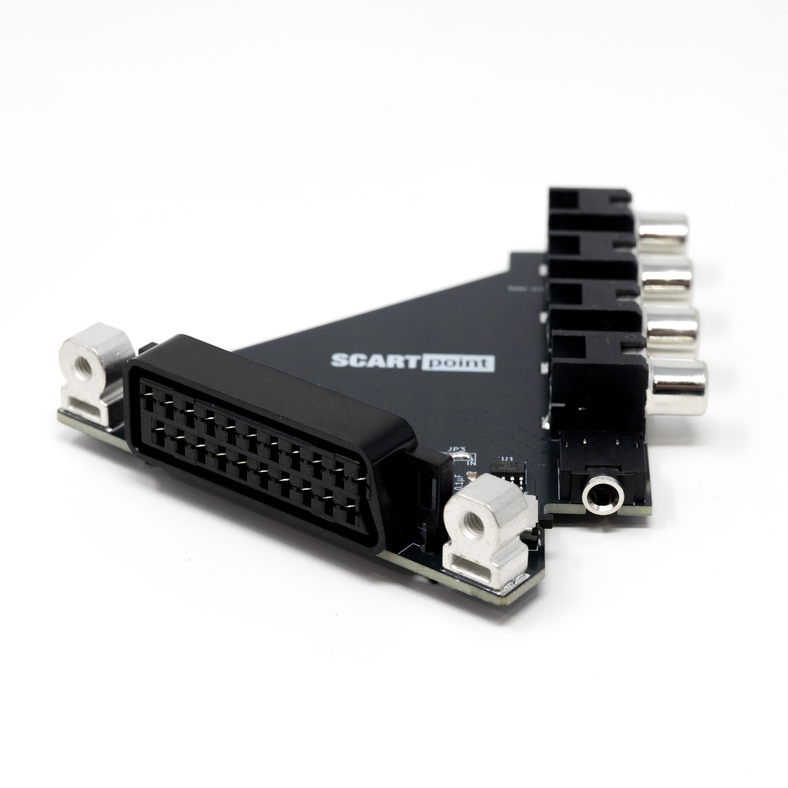

# SCARTpoint
Connect an RGBs (Red, Green, Blue, CSync) signal over SCART to an Extron Crosspoint. 

The SCARTpoint adapter allows a direct SCART connection to the Extron CrossPoint matrix switch. There are two geometries, an "upper" (3E-300009) and a "lower" (3E-300010), they need to be installed in an alternating pattern, two of the same geometry cannot be installed adjacently. Both geometries are configurable as inputs (to Extron) or outputs (from Extron) using solder jumpers and the proper components.

This is for use only with Extron Crosspoint matrix switches with the following BNC center-to-center dimensions:
- Horizontal: 	17.2mm
- Vertical:		16.5mm
- This will not fit older units with 20.3 mm vertical distance.

Fully assembled and QC tested SCARTpoint adapters can be [purchased here](https://kytor.com/store/product/scartpoint/).

## Files Included
- **PCB Design Files** (KiCAD, Gerber)
- **Bill of Materials** (XLSX)
- **CAD** (STEP)
- **Photos**

## Features
- SCART-Lock mounting posts in accordance with KTL 0158 specification.
- Female SCART connection.
- Female TRS 3.5mm stereo audio connection.
- Male RCA Red, Green, Blue, Sync connections.
- Input Only: LM1881M Sync Stripper for CSync. (Optional)
- Input Only: Switch to Disable or Enable Sync Stripper. (Optional)
- Output Only: 470 ohm Resistor for 75ohm level CSync.

## Additional Parts Required
- [SCART-Lock](https://kytor.com/store/product/rt4k-scart-lock/) or [Print Your Own](https://www.printables.com/model/873880)
- [90 Degree Stereo TRS Cable](https://amzn.to/44nj7Mh)
- [BNC Male to RCA Male Adapter](https://www.aliexpress.us/item/3256803887270180.html) (4x)
- [Phoenix to 3.5 mm Adapter](https://github.com/arithmaldor/phoenix-audio-adapter-kicad)

## Assembly
1. Input Only: Solder C1, C2, U1 and SW1 in place. Alternatively if sync stripper is not needed, C1, C2, U1 and SW1 may be left unpopulated and jumper JP4 can be soldered.
2. Output Only: Solder R1 in place.
3. Both: Solder J4-6 in place. P1-2 may be soldered in place as mounting posts for the SCART-Lock.
2. Close solder jumpers JP1-3 appropriately for either input or output type.

## PCB Revision History
- Rev 0 - Initial production release

## Resources and Credits
This project was inspired by the [rattboi adapters](https://github.com/rattboi/extron-scart-adapter).

## License
This project is open-source under the [CC BY 4.0 (Attribution 4.0 International)](https://creativecommons.org/licenses/by/4.0/).

## Disclaimer
This project is provided "as-is" without any warranty, express or implied, including but not limited to warranties of merchantability or fitness for a particular purpose. No support is provided.

Amazon links are affiliates.